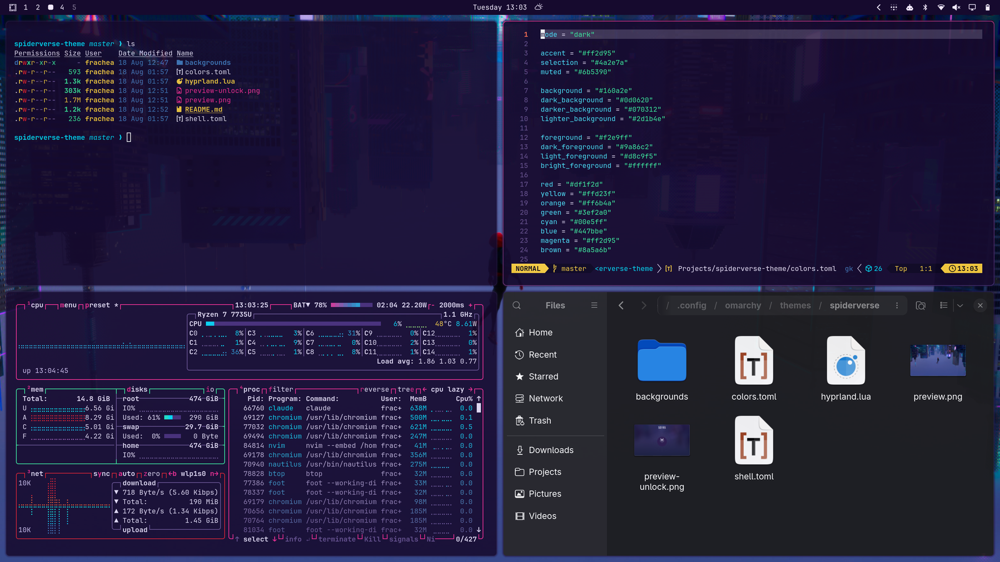
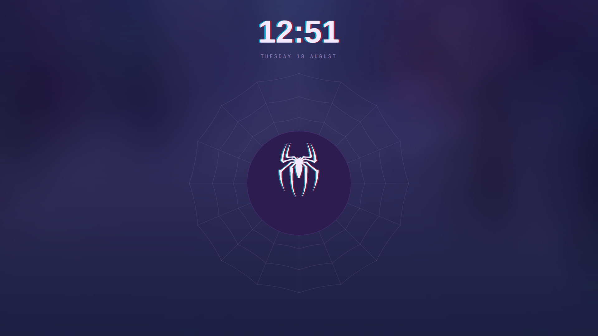
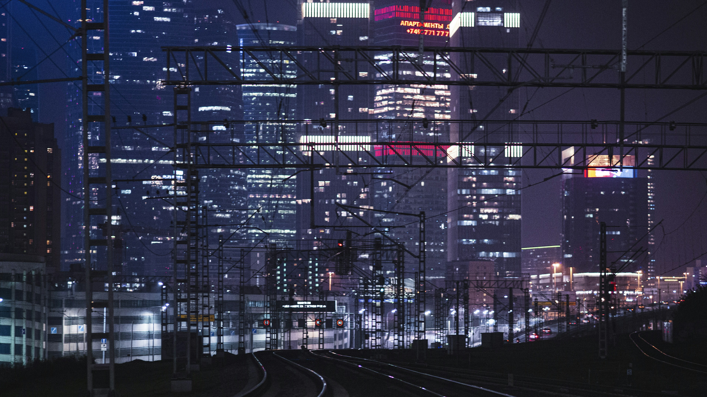
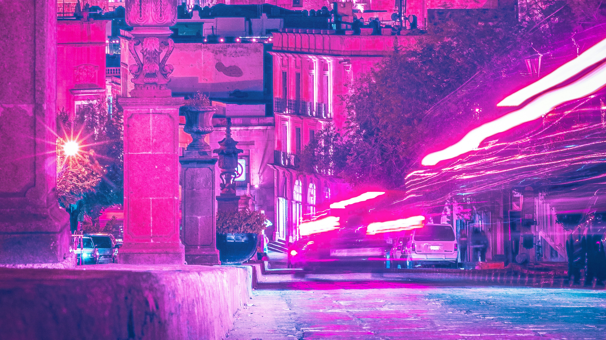
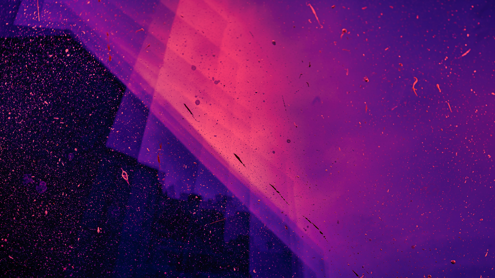

# Spiderverse - Omarchy Theme

Across-the-Spider-Verse-inspired theme for Omarchy: indigo/violet base,
magenta accent, cyan/red glitch-split highlights, and punchier "comic panel
pop" window animations.

## To install:
1. Copy the theme repository URL
2. Click `SUPER + SPACE`
3. Click `Install`
4. Click `Style`
5. Click `Theme`
6. Paste the link and hit enter to submit

### 2nd way to install
```bash
omarchy theme install https://github.com/axelfrache/omarchy-spiderverse-theme
```

## Preview







## Backgrounds

All three are free-to-use photos from [Unsplash](https://unsplash.com):

- `city-rails.jpg` -- [Aleksandr Popov](https://unsplash.com/photos/a-train-track-in-a-city-at-night-gntKJtW9sfk)
- `mexico-nights.jpg` -- [Eduardo Pastor](https://unsplash.com/photos/a-city-at-night-lit-up-with-neon-lights-gH3hDhmkdFo)
- `particle-glitch.jpg` -- [Jr Korpa](https://unsplash.com/photos/neon-pink-and-purple-light-particles-9XngoIpxcEo)

Released under the [Unsplash License](https://unsplash.com/license) --
free for commercial and personal use, no permission or attribution required.
Credited here anyway.

## Also available

A matching radial app launcher and lock screen live in a separate repo:
[spiderverse-omarchy](https://github.com/axelfrache/spiderverse-omarchy).
`preview-unlock.png` above is an actual screenshot of that lock screen --
install it too if you want your real lock screen to match; without it,
locking just uses this theme's colors on Omarchy's stock lock screen.
